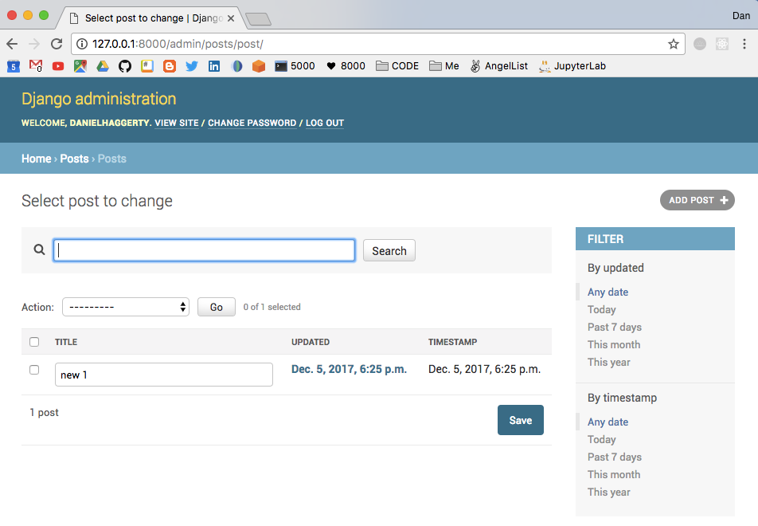

This is a step-by-step guide on how I built my blogging application found [here](https://porkpy.com/). Built with Django and based upon the Udemy tutorial found [here](https://www.udemy.com/try-django/learn/v4/content).

### Setup (v0.1)
We will download all our python packages that are specific to our app into a virtual environment. So  we need to install the package that gives us the ability to make a virtual environment, make, and then activate the virtual environment.

```
pip3 install virtualenv
```

Now in our the folder that we wish to create the app...
1. Make the virtual environment
2. Install Django
3. Create a Django project

```
mkvirtualenv django_blog
pip3 install django
django-admin.py startproject django_blog
```

This will create a Django app by downloading folders to your current directory.
The folder structure should look something like the following...


Next, we need to make a GitHub repository to store all our code. There are several ways to make a local git repository on your computer. Firstly we need to log into GitHub and create a new repository. Then clone this repository into our local folder and set the remote repository to that on GitHub so that each time we commit our local files to GitHub they go into the correct GitHub repository.

My code resides in a local directory `django_blog` and in the repository [here](https://github.com/danhagg/django-blog-app) on GitHub. To achieve the linking of the two repositories we do the following in the local app folder terminal...

```
cd django_blog
git init
git add -A
git commit -m "first commit"
git remote add origin git@github.com:danhagg/django-blog-app.git
git push -u origin master
```

So, our local and remote repositories are linked. Lets run the django app we just created from the terminal in our development server.

```
python3 manage.py runserver
```

And view the output in the browser at `http://127.0.0.1:8000/`. You should see the following...


We can add these files and push them to GitHub.

```
git add -A
git commit -m"default app"
git push
```

Then on GitHub we can navigate to the `releases` tab. Hit `Draft new release`. Add the tag name `v0.1` and target the most recent commit we just made and publish. We will repeat this process of push files to GitHub and making a tagged release over and over.

### v0.2

We can now create a superuser to login to our app
```
python3 manage.py migrate
python3 manage.py createsuperuser
```

If we look in our `settings.py` we have access to these installed apps:

```py
INSTALLED_APPS = [
    'django.contrib.admin',
    'django.contrib.auth',
    'django.contrib.contenttypes',
    'django.contrib.sessions',
    'django.contrib.messages',
    'django.contrib.staticfiles',
]
```

We have a pre-installed `admin` app. So, in our browser at `http://127.0.0.1:8000/admin` we can use this `app` and login with the superuser details.

We can also make more `apps`. The first `app` that we will add is a `posts`. Which we can do with the following terminal command.

```
python3 manage.py startapp posts
```

Which installs a new folder in our app called `posts`.


1. migrations
2.  \__init__.py (empty, makes the `posts` folder a module)
3. admin.py (ties the module to admin)
4. apps.py (allows us to configure the `posts` module. We will not touch it.)
4. models.py (how we will map our data to database)
5. tests.py (design tests for automated testing)
6. views.py (showing us how something is displayed inside an app)

We are using an `MVC` which is a `Model, View, Controller`.

`MVC` is a software architectural design pattern which allows one to organize ones program to separate functionality within our application. There is no strict way to do `MVC` programming but in general we can break up most of our application functionality into separate files along the following lines.

1. Model
  - Data related logic
  - Database interactions
  - Communicates with `controller`. The `controller` can request data through the `model`.
2. View
  - Actual `view` of application. The `UI`. `HTML` and `CSS` and `template engines` that allow for dynamic data from `controller`.
  - Communicates with `controller`.
3. Controller
  - Takes in user input.
  - Deals with requests.
  - Retrieves data from `model` and channels to the `view`.

Although Django does broadly follow the `MVC` paradigm it does have some differences as shown in the diagram below.


The `controller` is mainly carried out by the framework itself and most of the action occurs in `Models`, `Templates` and `Views` and so Django is often referred to as `MTV`.
1. Models
2. Templates (In `MVC`: `view`-like)
  - The presentation layer
3. Views (In `MVC`: `controller`-like)
  - The business logic layer. Acts as the middle man between `model` and `template`.

We shall employ the use of a `model` to associate with what we want in the database. We can add various `fields` to our `models` and they are described in the Django documentation [here](https://docs.djangoproject.com/en/1.11/ref/models/fields/).

In `models.py`:
```py
from __future__ import unicode_literals

from django.db import models


class Post(models.Model):
    title = models.CharField(max_lebgth=120)
    content = models.TextField()
    updated = models.DateTimeField(auto_now=True, auto_now_add=False)
    timestamp = models.DateTimeField(auto_now=False, auto_now_add=True)


def __str__(self):
    return self.title
```

We need to add the model to our application using `settings.py`.

```py
# simply add the name of our module 'posts'
INSTALLED_APPS = [
    'django.contrib.admin',
    'django.contrib.auth',
    'django.contrib.contenttypes',
    'django.contrib.sessions',
    'django.contrib.messages',
    'django.contrib.staticfiles',
    'posts'
]
```
Then we can run the following command in the terminal.
```
python3 manage.py migrate
```
We get the following error... :-1:

`Your models have changes that are not yet reflected in a migration, and so won't be applied. Run 'manage.py makemigrations' to make new migrations, and then re-run 'manage.py migrate' to apply them.`

What this implies is that something in our `models` has changed. Namely the changes we added to `post/models.py`. Django has recognized this and told us that we need to migrate these changes to our database as the database and django project are not in sync.

Thus, we run...

```
python3 manage.py makemigrations
```

This command yields the following:

```
Migrations for 'posts':
  posts/migrations/0001_initial.py
    - Create model Post
```

That `0001_initial.py` file tells us what the changes were but it does not yet apply them to the database. To make those changes we run the following to put our `post model` in the database:

```
python3 manage.py migrate
```

Now we shall try and add this to the `admin.py`

```py
from django.contrib import admin

# relative import as admin & models both in in same folder Posts
from .models import Post

# built-in admin function that registers post model into admin site
admin.site.register(Post)
```

We now see the following in our `http://127.0.0.1:8000/admin`.


We can even click on posts and select to add to them if we so wish.

We shall push to GitHub and `tag` this new release. In the local `git` repository.

```
git add -A
git commit -m"added post functionality"
git push
```

Then on GitHub we can navigate to the `releases` tab. Hit `Draft new release`. Add the tag name `v0.2` and target the most recent commit we just made and publish.

### v0.3
Create a model admin. Documentation [here](https://docs.djangoproject.com/en/2.0/ref/contrib/admin/#modeladmin-options).

In `posts/admin.py`:
```py
from django.contrib import admin

from .models import Post


# ModelAdmin refers to Post model
# Need to set the Model itself
# we can play with the admin options here and check them in localhost:8000/admin
class PostModelAdmin(admin.ModelAdmin):
    list_display = ['title', 'updated', 'timestamp']
    list_display_links = ['updated']
    list_editable = ['title']
    list_filter = ['updated', 'timestamp']
    search_fields = ['title', 'content']

    class Meta:
        model = Post


# Bring it in to admin.site.register
# We have now connected Post model with PostModelAdmin
admin.site.register(Post, PostModelAdmin)
```
Our blog admin page Is now endowed with the variables defined in our PostModelAdmin class.



##### CRUD (Create, Retrieve, Update, Destroy)
CRUD is how our app works with the database. We create a crud.md file.
```
CREATE -- POST
RETRIEVE -- GET -- List / Search
UPDATE -- PUT/PATCH -- Edit
DELETE --  DELETE -- Delete
```
The admin built-n with Django performs CRUD extremely well. Note that the CRUD acronym mirrors HTTP methods. And SQL (INSERT, SELECT, UPDATE, DELETE). To handle all these methods we use views.
1. CREATE view
2. RETRIEVE view
3. UPDATE view
4. DELETE view

Now we can write our first view to display HTML as we want it to be displayed. So, we have stuff in `posts` table lets see if we can view it by modifying the `posts/view.py`. We will make `function-based views` not `class-based views`.

`posts/views.py`
```py
from django.http import HttpResponse
from django.shortcuts import render


# Create your views here.
def posts_home(request):
    return HttpResponse('<h1>Hello</h1>')
```
We need to map a `url` to the `view`. To send the request to where it needs to go.

`urls.py`
```py
from django.conf.urls import url
from django.contrib import admin

# takes the <app name>.views.<function_name>
urlpatterns = [
    url(r'^admin/', admin.site.urls),
    url(r'^posts/$', 'posts.views.post_home')
]
```

Now going to make views and urls combined into the posts app. We make a `posts/urls.py` file:

```py
from django.conf.urls import url
from django.contrib import admin

# takes the <app name>.views.<function_name>
urlpatterns = [url(r'^$', 'posts.views.post_home')]
```

```py
from django.conf.urls import include, url
from django.contrib import admin

# modify to include all posts.urls to the posts/ url
urlpatterns = [
    url(r'^admin/', admin.site.urls),
    url(r'^posts/', include('posts.urls'))
]
```

Now our `posts` `views` are being delivered through the `posts/urls.py` file.

Now, back in our view `post/views.py` we need to work on our `CRUD` methodology.

```py
from django.http import HttpResponse
from django.shortcuts import render

# We will factor in functions for each CRUD component
# CREATE -- POST
# RETRIEVE -- GET -- List / Search
# UPDATE PUT/PATCH -- Edit
# DELETE --  DELETE -- Delete


def post_create(request):  # CREATE
    return HttpResponse('<h1>Create</h1>')


def post_detail(request):  # RETRIEVE
    return HttpResponse('<h1>Detail</h1>')


def post_list(request):  # list items
    return HttpResponse('<h1>List</h1>')


def post_update(request):  # UPDATE
    return HttpResponse('<h1>Update</h1>')


def post_delete(request):  # DELETE
    return HttpResponse('<h1>Delete</h1>')
```

We can now put these functions into our `posts/urls.py`.

```py
from django.conf.urls import url
from django.contrib import admin

# will port only from posts/views
from .views import (
    post_list,
    post_create,
    post_detail,
    post_update,
    post_delete,
)

# we can make our urls linked to view functions
# lists is simply going to be the default posts url
urlpatterns = [
    url(r'^$', post_list),
    url(r'^create/$', post_create),
    url(r'^detail/$', post_detail),
    url(r'^update/$', post_update),
    url(r'^delete/$', post_delete),
]
```

Now if we go to our default `posts` url we should see the `post_list` function in our `views.py` displayed... Well, is that what we see?


Now lets add some templates keeps our Django code nice and clean and keeps the front-end as separate as possible from the backend.

In `settings.py` it is worth noting the following line of code

```py
BASE_DIR = os.path.dirname(os.path.dirname(os.path.abspath(__file__)))
```

The use of `os` here line assigns the location of our `manage.py` file to the variable `BASE_DIR`. We shall use the same `os` method to point to our templates. So, in same `settings.py` file, we apply the BASE_DIR to 'DIRS'.

```py
TEMPLATES = [
    {
        'BACKEND': 'django.template.backends.django.DjangoTemplates',
        'DIRS': [os.path.join(BASE_DIR, 'templates')],
        'APP_DIRS': True,
        'OPTIONS': {
            'context_processors': [
                'django.template.context_processors.debug',
                'django.template.context_processors.request',
                'django.contrib.auth.context_processors.auth',
                'django.contrib.messages.context_processors.messages',
            ],
        },
    },
]
```
We also need to make a folder to hold all our html and templating codin. Lets make a new folder and file thusly: `src/templates/index.html`.

```html
<!--DOCTYPE html -->
<html>
<body>
  <h1>Template is working</h1>
</body>

</html>
```

In `views.py` we change-up our `post_list` function to render the `html` we just coded. We will look at the empty dictionary `{}` in the following section
```py
def post_list(request):  # list items
    return render(request, 'index.html', {})
```


##### Using Template contexts
`Context` (fin the case of unction-based views) or `context-data` (class-based views) are often used as variable names for dictionaries in templates. These names are optional.

If we slightly modify two of the functions in `posts/views.py` to
1. define a context dictionary variable
2. return a rendering of the `index.html` and the dictionary

We also need to modify the `index.html` file to accept the context variables.
```html
<!--DOCTYPE html -->
<html>
<body>
  <h1>{{ title }} is working</h1>
</body>

</html>
```
So now at `http://127.0.0.1:8000/posts/`


Whereas at `http://127.0.0.1:8000/posts/detail/` we get...


Let's use the `details` we page to workout the chain of events here:

1. In the `posts/views.py` file we have our `post_detail` function that takes in a `request`, defines a `context` with a key value pair of `'title: 'detail'`.

```py
def post_detail(request):  # RETRIEVE
    context = {"title": "Detail"}
    return render(request, 'index.html', context)
```

2. In the `posts/urls.py` file we have a `url pattern` that accepts the `post_detail` function as an argument and assigns it to any url ending with `'detail/'`.

```py
urlpatterns = [
    ...
    url(r'^detail/$', post_detail)
    ...
    ]
```

Finally, our `index.html` file renders with the title argument sent to it by the `post_detail` function.

```html
<body>
  <h1>{{ title }} is working</h1>
</body>
```

### Query Sets
First use python shell then bring into `view`.

```
python3 manage.py shell
```

To use any `model` in an app we need to import it. Needs to be a full path import in shell.

In python shell we can query the database in the following manner:

```py
(InteractiveConsole)
>>> from posts.models import Post
>>> Post.objects.all()
[<Post: post 1>, <Post: post 2>]
>>> Post.objects.create(title="New Post", content="New content")
<Post: New Post>
>>> Post.objects.all()
[<Post: post 1>, <Post: post 2>, <Post: New Post>]
>>> queryset = Post.objects.all()
>>> for obj in queryset:
...     print(obj.title, obj.id, obj.pk)
...
post 1 1 1
post 2 2 2
New Post 3 3
```

Given that this is how it's done in the shell we can now perform the same querying in our `views.py`.

```py
from .models import Post

...

def post_list(request):  # list items
    queryset = Post.objects.all()
    context = {"object_list": queryset, "title": "List"}
    return render(request, 'index.html', context)
```

In `index.html`.

```html
<body>
  <h1>{{ title }} is working</h1>



{{ obj.title }}<br/>
{{ obj.content }}<br/>
{{ obj.timestamp }}<br/>
{{ obj.updated }}<br/>
{{ obj.id }}<br/>



</body>
```

Gives...


### Make individual posts
In `views.py`

```py
from django.shortcuts import render, get_object_or_404

...
# Add get_object_or_404 and the link to 'post_detail.html'
ddef post_detail(request):  # RETRIEVE
    instance = get_object_or_404(Post, id=1)
    context = {"title": instance.title, "instance": instance}
    return render(request, 'post_detail.html', context)
```

Make a new `html` for detail `templates/index.html`.

```html
<body>
  <h1>{{ title }}</h1>

{{ instance.title }}<br/>
{{ instance.content }}<br/>
{{ instance.timestamp }}<br/>
{{ instance.updated }}<br/>
{{ instance.id }}<br/>

</body>
```
